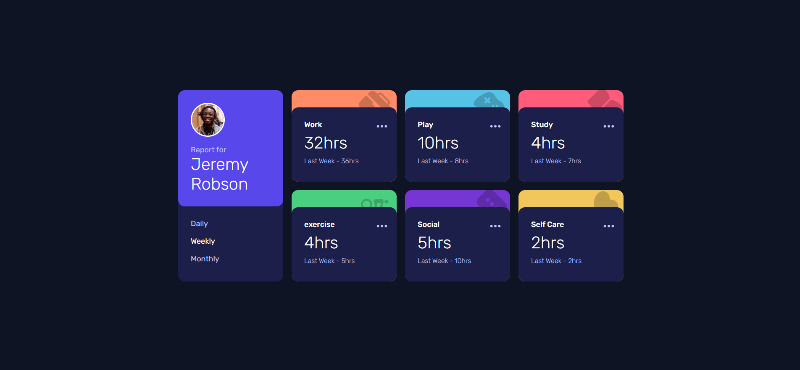
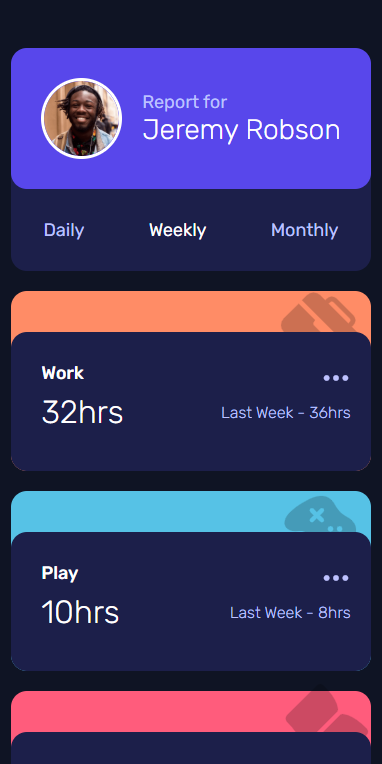

# Frontend Mentor - Time tracking dashboard solution

This is a solution to the [Time tracking dashboard challenge on Frontend Mentor](https://www.frontendmentor.io/challenges/time-tracking-dashboard-UIQ7167Jw). Frontend Mentor challenges help you improve your coding skills by building realistic projects. 

## Table of contents

- [Overview](#overview)
  - [The challenge](#the-challenge)
  - [Screenshot](#screenshot)
  - [Links](#links)
- [My process](#my-process)
  - [Built with](#built-with)
  - [What I learned](#what-i-learned)
  - [Continued development](#continued-development)
- [Author](#author)

## Overview

### The challenge

Users should be able to:

- View the optimal layout for the site depending on their device's screen size
- See hover states for all interactive elements on the page
- Switch between viewing Daily, Weekly, and Monthly stats

### Screenshot

### Links

- Solution URL: [https://github.com/aksoyalpi/time-tracking-dashboard](https://github.com/aksoyalpi/time-tracking-dashboard)
- Live Site URL: [https://aksoyalpi.github.io/time-tracking-dashboard/](https://aksoyalpi.github.io/time-tracking-dashboard/)

## My process

### Built with

- Semantic HTML5 markup
- CSS custom properties
- Flexbox
- CSS Grid
- Media queries
- Mobile-first workflow
- Sass
- JavaScript
- Data fetching
- DOM Manipulation
- CSS data attributes

### What I learned

- Working more performant with css data classes in combination with JavaScript DOM manipulation

### Continued development

Of course, it would be better to work with frameworks like React, but I wanted to use only native architectures to better understand what happens in the background.
In the future, nevertheless I will work with Frameworks.

## Author

- Website - [Alperen Aksoy](https://alperenaksoy.de)

